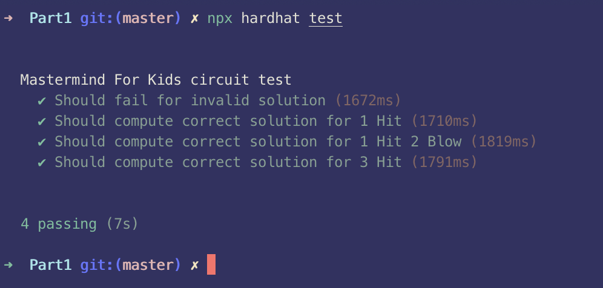
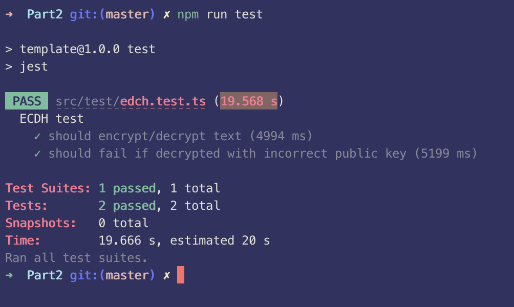

# Part 1 Circom in games

## Part 1.1 Brute-Force Prevention

What have the authors done in their implementations to protect them from brute-force attacks?

### Hit And Blow Implementation

This implementation of Hit And Blow supports two players guessing each other's secret combination at the same time. It works as follows:

1. Player 1 and Player 2 register for the game.
2. Player 1 and Player 2 submit their commitment hashes, which is a hash of their secret 4-digit combination and a privately withheld salt.
3. Player 1 submits a guess of Player 2's 4-digit combination by sending a transaction to the `HitAndBlow` smart contract's [`submitGuess` contract method](https://github.com/enu-kuro/zku-final-project/blob/main/contracts/HitAndBlow.sol#L208-L230).
4. Player 2 public proves the number of Hits and Blows achieved by Player 1 by submitting a proof to the smart contract's [`submitHbProof` contract method](https://github.com/enu-kuro/zku-final-project/blob/main/contracts/HitAndBlow.sol#L232-L277). The ZK proof is generated client-side on the browser of Player 2 by inputting 1) the salt and 2) the 4-digit combination as private variables into the circuit, with both secrets stored locally on the client of Player 2. After each proof submission, the round for Player 1 increments.
5. Steps 3-5 is the same as mirrored for Player 2.
6. When a player has proven that their opponent has scored 4 hits, the opponent becomes the winner and the game state resets.

Step 4 is the most interesting part of the whole Mastermind game that leverages ZKP to prove that the player with the secret combination isn't lying about the number of hits and blows that the opponent has achieved with their latest guess.

### How to Brute-Force

Verifier smart contracts must be deployed prior to the deployment of the Hit And Blow game state contract. It is trivial to check the address of the verifier contract from the calldata upon deploying the Hit And Blow contract, as per [the constructor method](https://github.com/enu-kuro/zku-final-project/blob/main/contracts/HitAndBlow.sol#L106-L110). Since verifying proofs with the `verifyProof` contract method are costless / gas-free interactions, anyone can generate the entire list of permutations, call `verifyProof` for each proof until `true` is returned for which there are 4 Hits, and submit that proof to win the game in 1 round. This can be mitigated by increasing the search space for the solution, but in this case, the search space is small.

### Prevention

In order to prevent brute-force attacks, the authors made use of salts when hashing - specifically, the salt is an additional input parameter to the Poseidon hash function in the client-side proof generation circuit, along with the 4-digit combination. Due to the collision resistance property of hash functions, it becomes computationally and probabilistically impossible for the guessing player to generate a **single** valid proof (let alone all of the permutations). Hence, guessing players are disincentivized to perform a brute-force attack, and will more likely leave it to the player with the secret to generate Hit And Blow proofs - this is the intended, "happy path" user behavior after all.

## Part 1.2 Custom Mastermind

Here I implement Mastermind for Kids where there are 6 colors with 3 holes.

## Part 1.3 Test Circom

Attached is a picture proof of the unit tests of the circom circuit passing:

## Part 1.4 Suggest A Game - Telepathy

### Setup

Telepathy is a board game that is similar to Hit And Blow.

Two players each have a public board that consists of a grid of squares with each square containing 4 attributes - color, symbol, row letter and column number. For example, one square might be "A 2 Yellow Heart". Each player secretly chooses a square and notes down its 4 attributes privately.

### Objective

The objective of the player is to be the first one to correctly guess the square that was privately chosen by their opponent.

### Gameplay

Each round, a player can attempt to guess the 4 attributes of their opponent's secretly chosen square.

If none of the 4 attributes match any of their opponent's square's attributes, the opponent responds "No". The guessing player then proceeds to rule out the guessed row, column, color and symbol on their own board.

If any of the 4 attributes match any of their opponent's square's attributes - even if the guess is exactly their secret square" - the opponent responds "Yes". The guessing player then proceeds to circle the square that they had guessed on their own board.

"Yes" and "No" are the only responses players can make to answer each question.

When players are ready to make their final guess, they inform the other player before doing so. If the final guess is correct, the guessing player wins the game. Otherwise, the guessing player loses the game.

Watch this video to learn more about how this game is played: https://www.youtube.com/watch?v=-QI_cXAVgNU

### How Does ZKP Benefit The Game

The game relies on each player trusting the opponent will not lie about their "Yes" / "No" responses. Players can abuse their opponent's trust to their own advantage.

Zero-knowledge proofs enables responding players to prove that they are not lying about their "Yes" / "No" response without revealing exactly what their secret 4 attributes are. Hence, ZKP makes the game **trustless**.

### Implementing The Game With ZKP

Similar to Hit And Blow, there can be a smart contract that manages game start, guess submission, revealing secret attributes, and "Yes" / "No" proof submissions for Telepathy. A circom circuit will need to be created for proof generation.

This is what the circom circuit should achieve:

- **Public Inputs**:
  - Guessed row
  - Guessed column
  - Guessed color
  - Guessed symbol
  - Yes / No
    - 0 for No, 1 for Yes
  - Hash of the solution (the 4 secret attributes and a salt)
- **Private Inputs**:
  - Secret row
  - Secret column
  - Secret color
  - Secret symbol
  - Secret sale
- **Public Outputs**:
  - Hash of the solution
- **Operations**:
  - Constrain guessed row to be within range
  - Constrain guessed column to be within range
  - Constrain guessed color to be within range
  - Constrain guessed symbol to be within range
  - Keep a flag to track whether any of the 4 secret attributes have been guessed.
  - Verify that the hash of the 4 secret attributes + salt matches the public input hash of the solution.

Game flow:

1. Players register themselves onto the game state contract.
2. One player chooses the digit representation (ie. number of colors mapped into numerical range) of 4 secret attributes, calculates its hash with a privately stored salt, and commits it to the game state contract. The guessing game begins.
3. The guessing player submits guesses to the smart contract.
4. The responding player generates client-side proofs of their "Yes" / "No" response and submits it to the smart contract.
5. Steps 3-4 repeat until the guessing player decides to submit their final guess, after which the 4 secret attributes will be revealed and a winner will be chosen.

### Brute-Force Protection

Similar to the Hit And Blow example as discussed above, a salt can be used to protect against brute-force attacks.

Without salts, it is possible for a malicious actor to perform an attack to win the game in 1 round by generating all the proofs for both "Yes" and "No" responses on the client-side, deducing the secret attributes, and then submitting their first and final guess to win. This attack is especially easy to perform considering the solution search space is merely 324 given a regular 18x18 board.

# Part 2 Anti-collusion and Fairness

## Part 2.1 MACI

The participants of MACI are voters and a coordinator. All voter interactions with the smart contract are encrypted with the coordinator's public key, and the commands available to voters are at least 1) cast vote and 2) change registered keypair. With encryption, collusion resistance is made possible if the coordinator behaves honestly, as there is always a mechanism for bribees to **plausibly** claim they had acted according to the bribe even if they truly had not, eg. use an outdated public key.

MACI prevents bribery, since there is no way for the briber to know for certain that the bribee acted in accordance with the bribe. This is true as long as there is at least 1 encrypted command before the bribee's vote command.

MACI does not solve self-voting attacks or design against plutocracy.

## Part 2.2 circomlibjs ECDH

Below is a screenshot for proof that unit tests are passing:

## Part 2.3 VDF Computation

A Verifiable Delay Function (VDF) f must be sequential - given a delay time t, anyone can compute the solution f(x) in t sequential steps, but no adversary with a large number of processors can distinguish the output of f(x) from random in significantly fewer steps.

This definition means that the computation of the solution f(x) **must be performed serially** as opposed to in parallel. In other words, if computing the next sequential output requires knowledge of the output of the latest computation, then a system operating in parallel would still require knowledge of each computation step. Hence, having many computers operating in parallel cannot compute the solution faster than a single processor.

## Part 2.4 ZK Blind Auction Upgrade

In order to eliminate the need for a centralized server while maintaining the privacy of the bid value, Homomorphic Encryption can be used to enable computation over encrypted values without first decrypting them. The resulting computations are left in an encrypted form which, when decrypted, is identical to the output that is produced had the same computation been performed over decrypted values instead Encrypting bid amounts maintains privacy of these values, and computation is necessary in order to select the encrypted value corresponding to the highest bid amount. This allows users to submit encrypted bid amounts to any server, instead of relying on centralized infrastructure.

In order to ensure bidders will come back to reveal their bid values and/or claim the auction item, there can be a requirement for bidders to deposit a fixed amount of tokens along with their bid commitments. While a fixed deposit amount is not related to bid values and thus preserves the bid values' privacy, this scheme can subsidize / be ineffective against plutocracies. Therefore, an improvement might be to introduce tiers of deposit amounts based on the bid values.

Imagine the following deposit requirements:

- Deposit 0.1 ETH for bid values between 0 ETH and 1 ETH.
- Deposit 1 ETH for bid values between 1 ETH and 10 ETH.
- Deposit 10 ETH for bid values greater than 10 ETH.

Now, bidders can lie about their blinded bid values in order to deposit a smaller amount than they should be - a 11 ETH bidder ideally prefers to deposit 0.1 ETH. This is where ZKP, specifically range proofs on private bid values, can be leveraged by bidders to generate valid proofs proving that their bid amount is within a particular range, without ever revealing the exact bid amount. With ZKP, we make the deposit process **trustless**.

To summarize, this latest scheme would require bidders to:

- Submit commitment (encrypted bid values)
- Deposit an amount of tokens corresponding to the correct bid amount tier
- Generate and submit valid range proof of their private bid values.

# Part 3 Time to start thinking about your final project!

## Part 3.1 Implementing ZK Blind Auction Upgrade

Assuming that the circuit to compute the winning bid value from a list of encrypted values is already built, the remaining components to build are:

- Frontend
- Smart Contract

A frontend is necessary for the following (user) flows:

- Select item to place blind auction for.
- Enter bid amount.
- Encrypt bid amounts.
- Generate range proofs of bid values.
- Submit encrypted commitments, valid range proofs, and also deposit tokens through transactions with the smart contract.

A smart contract is necessary to store user commitments of the encrypted bid values, user deposits, verifying range proofs, and triggering ownership transfer of the auctioned item to the winner.

Since the frontend depends on the smart contract, I will develop the smart contract before the frontend.

Frameworks:

- I will use NextJS to bootstrap a basic server for the web frontend.
- I will use ethers.js for interacting with the blockchain.
- I will use Hardhat for smart contract development.

## Part 3.2 Final Project

### Idea 1: ZK Token Gates

Prove ownership of a token owned by cold wallet without 1) revealing the identity of the cold wallet or 2) interacting with the cold wallet in the associated authentication / verification scheme.

Cold wallets are usually in possession of many high value assets. Cold wallets are also high friction - no user wants to engage their cold wallet in any web-based authentication / verification flow. From a security standpoint, they should never use cold wallets for these purposes.

At the same time, token gated experiences today actively require wallets to interact with the web-based verification flow. Users are thus forced to either 1) have hot wallets own these high-value assets, or 2) use cold wallets in this web flows - both are terrible for securing and protecting the users' assets.

Design overview:

- Since designing authentication / verification protocol, will need to study popular authentication protocols existing today, and what minimal amendments are necessary to fit my new use case, or if an entirely new scheme needs to be developed.
- Smart contract for verification purposes. Think about how to interact with ERC20 / ERC721 token contracts.
- Not sure if need circuits?

Anticipated obstacles:

- Need to narrow down on whether it is specific to a single-claim experience, or for general token-based authentication?
- If designing / upgrading existing authentication protocol, need to figure out how to design user-machine / machine-machine interactions with good UX for both users and developers to best ensure mass adoption.
- Not sure how circuits would fit into the picture just yet.

### Idea 2: Cards Against Humanity Game

Develop an on-chain Cards Against Humanity because we can't get enough games!

Cards Against Humanity is a card game where, each round players anonymously place entries that fill in the blanks of a publicly known sentence in an attempt to become the most highly voted entry among the group of players. Read more about the rules [here](https://www.ultraboardgames.com/cards-against-humanity/game-rules.php).

Semaphore can be leveraged to build a use case for this game. In order to do so, we have to prove the following:

- Player is authorized to play the game (after registration)
  - Semaphore allows proving set membership
- In each round, each player can only place one entry
  - Semaphore allows preventing double signalling

While doing so, we benefit from keeping private the users' identity and hence the specific entries that they placed.

Note that there needs to be a reveal phase where the authentic user who broadcasted the winning signal is made known publicly in order for the winning points to be attributed to the winning user.

The smart contract would:

- Register the identity commitment
- Verify the proof
- Store the nullifier hash to prevent double placing entries per each round from the same identity.

The circom circuit would:

- Take in private inputs
- Take in public inputs such as the merkle root.

### Idea 3: PVP Telepathy Game

Develop an on-chain PVP Telepathy game because we can't get enough games! This will be similar to the PVP version of Mastermind.

Design overview:

- Will need to write circuit as outlined in Part 1.4.
- Will need to write and deploy smart contract to manage game state.
- Will need to develop frontend to manage user interactions with smart contract and generating validity proofs.

Please reference Part 1.4 for more details.

### Idea 4: ZK Software Verification (half-baked)

Prove that a series of bytecode is compatible with a particular VM without revealing any details of what the bytecode does exactly.

Anticipated obstacles:

- Not sure about how useful this will be.

### Idea 5: ZK DeFi Price Discovery (half-baked)

Prove that a token price delta is valid given public knowledge of last known token price and private inputs of buy/sell amount of the token.

### Idea 6: ZK-KYC

Prove that a user is compliant with KYC standards without revealing PII of said user.
